# AI Toolkit - Modules Workflow

This document illustrates the workflows of classes and functions in the AI Toolkit using Mermaid diagrams.

## Table of Contents

1. [Configuration Management](#1-configuration-management)
2. [Model Management](#2-model-management)
3. [Prompt Management](#3-prompt-management)
4. [Output Parsing](#4-output-parsing)
5. [Streaming Processing](#5-streaming-processing)
6. [Error Handling](#6-error-handling)
7. [Token Management](#7-token-management)
8. [Utilities](#8-utilities)

---

## 1. Configuration Management

### 1.1 Complete Configuration Pipeline

```mermaid
graph TB
    A[.env File] --> B[EnvLoader]
    B --> C[os.environ]
    
    D[config.yaml] --> E[ConfigManager]
    C --> E
    E --> F[Config Dict with ${VAR} substituted]
    
    F --> G[ConfigValidator]
    G --> H{Valid?}
    H -->|Yes| I[Application]
    H -->|No| J[Error List]
    
    style A fill:#e1f5ff
    style D fill:#e1f5ff
    style I fill:#d4edda
    style J fill:#f8d7da
```

### 1.2 EnvLoader Workflow

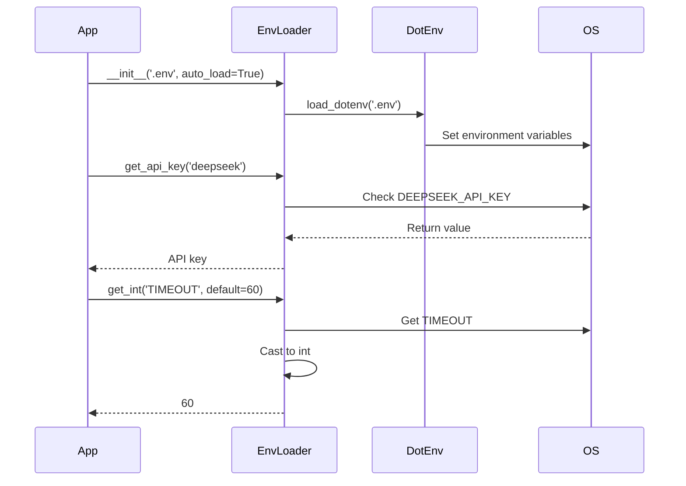
```mermaid
sequenceDiagram
    participant App
    participant EnvLoader
    participant DotEnv
    participant OS
    
    App->>EnvLoader: __init__('.env', auto_load=True)
    EnvLoader->>DotEnv: load_dotenv('.env')
    DotEnv->>OS: Set environment variables
    
    App->>EnvLoader: get_api_key('deepseek')
    EnvLoader->>OS: Check DEEPSEEK_API_KEY
    OS-->>EnvLoader: Return value
    EnvLoader-->>App: API key
    
    App->>EnvLoader: get_int('TIMEOUT', default=60)
    EnvLoader->>OS: Get TIMEOUT
    EnvLoader->>EnvLoader: Cast to int
    EnvLoader-->>App: 60
```

**Example:**
```python
env = EnvLoader('.env')
api_key = env.get_api_key('deepseek')  # Tries multiple naming conventions
timeout = env.get_int('TIMEOUT', default=60)
debug = env.get_bool('DEBUG', default=False)
```

### 1.3 ConfigManager Workflow

```mermaid
flowchart TD
    A[Load config.yaml] --> B[Parse YAML]
    B --> C[Store original config]
    C --> D[Substitute ${VAR} with env values]
    D --> E[Config ready]
    
    E --> F{Operation?}
    F -->|get_config| G[Navigate with dot notation]
    F -->|set_config| H[Create nested dicts]
    F -->|merge_configs| I[Deep merge multiple files]
    F -->|save_config| J[Write to YAML/JSON]
    
    G --> K[Return value]
    H --> K
    I --> K
    J --> K
    
    style A fill:#e1f5ff
    style E fill:#d4edda
    style K fill:#fff3cd
```

**Example:**
```python
config = ConfigManager('config/config.yaml')
api_key = config.get_config('models.deepseek.api_key')
config.set_config('models.deepseek.temperature', 0.8)
config.save_config()
```

### 1.4 ConfigValidator Workflow

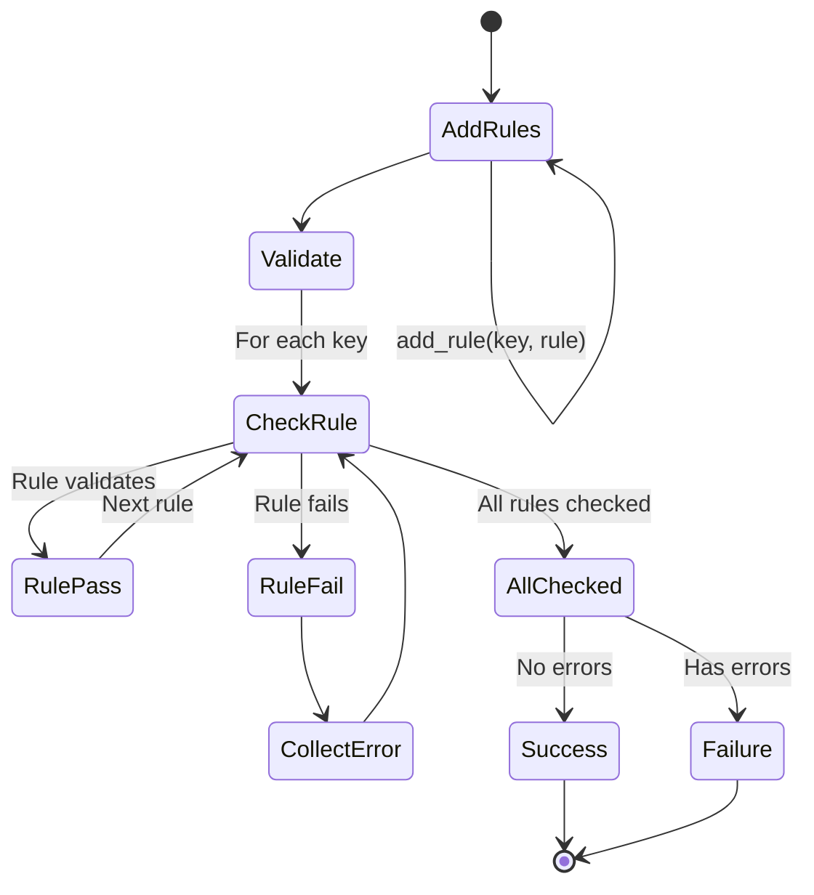
```mermaid
stateDiagram-v2
    [*] --> AddRules
    AddRules --> AddRules: add_rule(key, rule)
    AddRules --> Validate
    
    Validate --> CheckRule: For each key
    CheckRule --> RulePass: Rule validates
    CheckRule --> RuleFail: Rule fails
    
    RuleFail --> CollectError
    CollectError --> CheckRule
    
    RulePass --> CheckRule: Next rule
    CheckRule --> AllChecked: All rules checked
    
    AllChecked --> Success: No errors
    AllChecked --> Failure: Has errors
    
    Success --> [*]
    Failure --> [*]
```

**Example:**
```python
validator = ConfigValidator()
validator.add_rule('api_key', RequiredRule())
validator.add_rule('temperature', RangeRule(0.0, 2.0))

if validator.validate(config_dict):
    print("Valid!")
else:
    print(validator.get_errors())
```

---

## 2. Model Management

### 2.1 Model Creation Pipeline

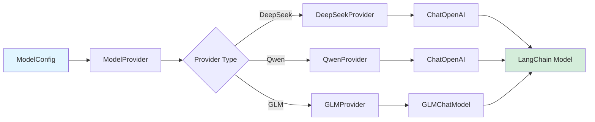
```mermaid
graph LR
    A[ModelConfig] --> B[ModelProvider]
    B --> C{Provider Type}
    C -->|DeepSeek| D[DeepSeekProvider]
    C -->|Qwen| E[QwenProvider]
    C -->|GLM| F[GLMProvider]
    
    D --> G[ChatOpenAI]
    E --> H[ChatOpenAI]
    F --> I[GLMChatModel]
    
    G --> J[LangChain Model]
    H --> J
    I --> J
    
    style A fill:#e1f5ff
    style J fill:#d4edda
```

### 2.2 ModelManager Workflow

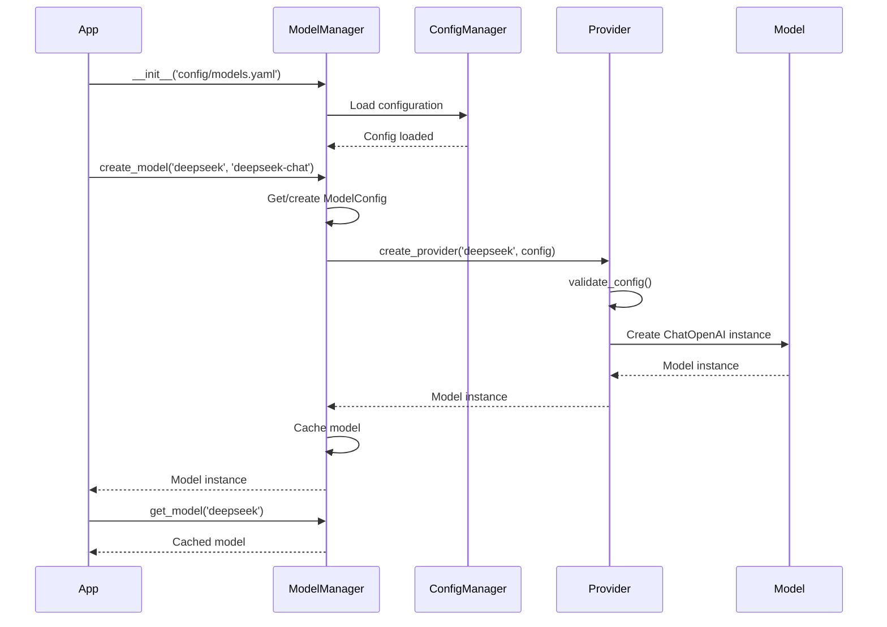
```mermaid
sequenceDiagram
    participant App
    participant ModelManager
    participant ConfigManager
    participant Provider
    participant Model
    
    App->>ModelManager: __init__('config/models.yaml')
    ModelManager->>ConfigManager: Load configuration
    ConfigManager-->>ModelManager: Config loaded
    
    App->>ModelManager: create_model('deepseek', 'deepseek-chat')
    ModelManager->>ModelManager: Get/create ModelConfig
    ModelManager->>Provider: create_provider('deepseek', config)
    Provider->>Provider: validate_config()
    Provider->>Model: Create ChatOpenAI instance
    Model-->>Provider: Model instance
    Provider-->>ModelManager: Model instance
    ModelManager->>ModelManager: Cache model
    ModelManager-->>App: Model instance
    
    App->>ModelManager: get_model('deepseek')
    ModelManager-->>App: Cached model
```

**Example:**
```python
manager = ModelManager('config/models.yaml')
model = manager.create_model('deepseek', 'deepseek-chat')
# Model is cached for reuse
cached_model = manager.get_model('deepseek')
```

### 2.3 Provider Selection Flow

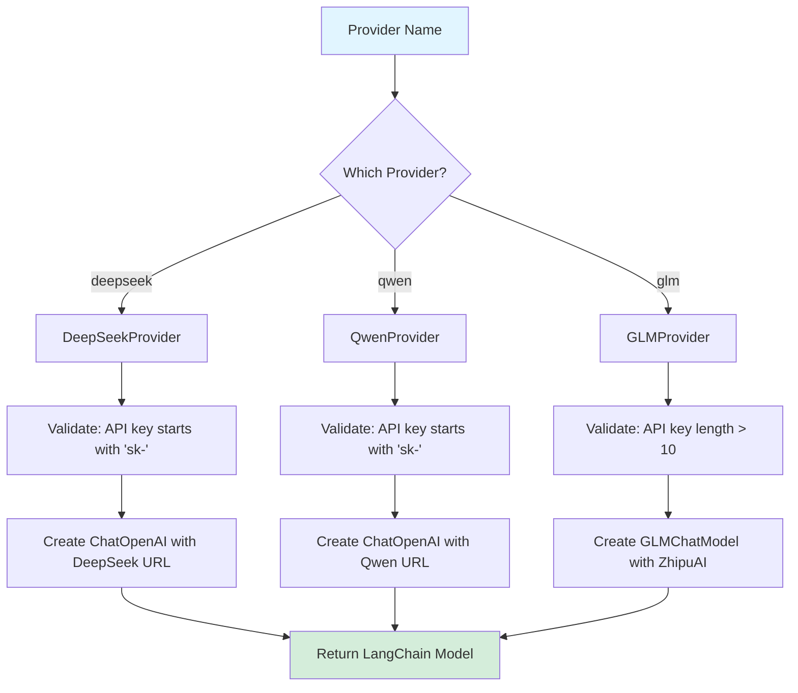
```mermaid
flowchart TD
    A[Provider Name] --> B{Which Provider?}
    B -->|deepseek| C[DeepSeekProvider]
    B -->|qwen| D[QwenProvider]
    B -->|glm| E[GLMProvider]
    
    C --> F[Validate: API key starts with 'sk-']
    D --> G[Validate: API key starts with 'sk-']
    E --> H[Validate: API key length > 10]
    
    F --> I[Create ChatOpenAI with DeepSeek URL]
    G --> J[Create ChatOpenAI with Qwen URL]
    H --> K[Create GLMChatModel with ZhipuAI]
    
    I --> L[Return LangChain Model]
    J --> L
    K --> L
    
    style A fill:#e1f5ff
    style L fill:#d4edda
```

---

## 3. Prompt Management

### 3.1 Prompt Template Rendering

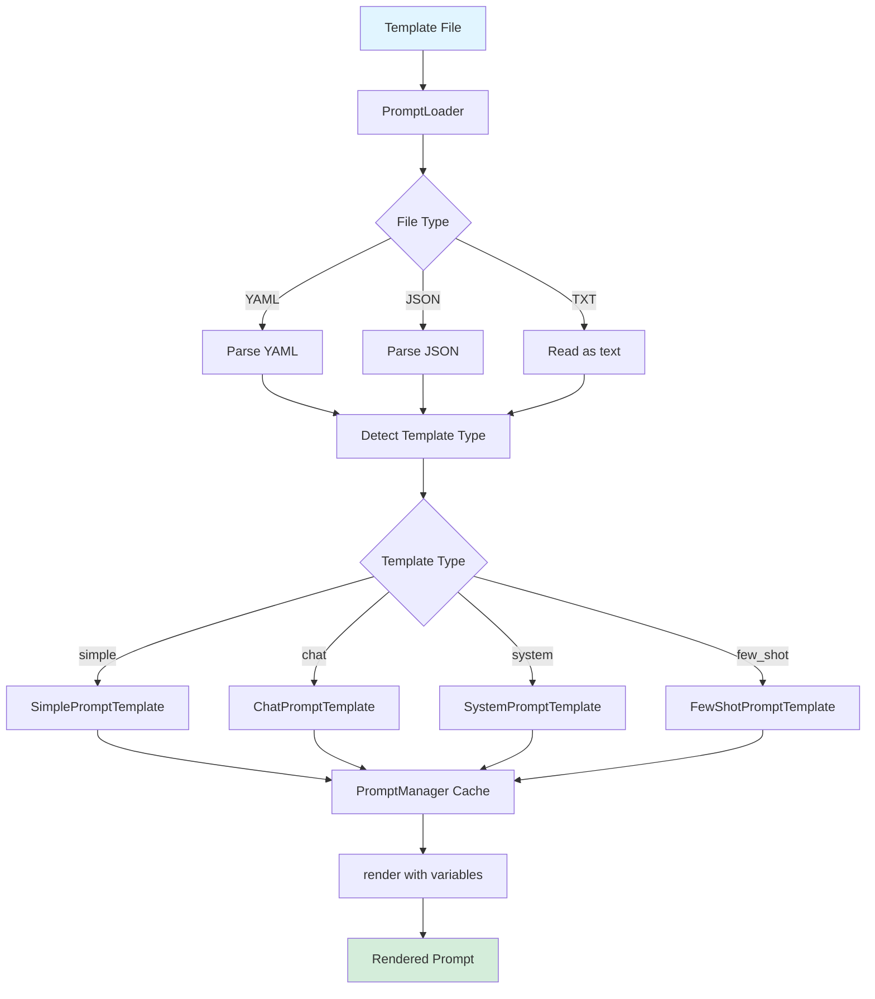
```mermaid
graph TB
    A[Template File] --> B[PromptLoader]
    B --> C{File Type}
    C -->|YAML| D[Parse YAML]
    C -->|JSON| E[Parse JSON]
    C -->|TXT| F[Read as text]
    
    D --> G[Detect Template Type]
    E --> G
    F --> G
    
    G --> H{Template Type}
    H -->|simple| I[SimplePromptTemplate]
    H -->|chat| J[ChatPromptTemplate]
    H -->|system| K[SystemPromptTemplate]
    H -->|few_shot| L[FewShotPromptTemplate]
    
    I --> M[PromptManager Cache]
    J --> M
    K --> M
    L --> M
    
    M --> N[render with variables]
    N --> O[Rendered Prompt]
    
    style A fill:#e1f5ff
    style O fill:#d4edda
```

### 3.2 PromptManager Workflow

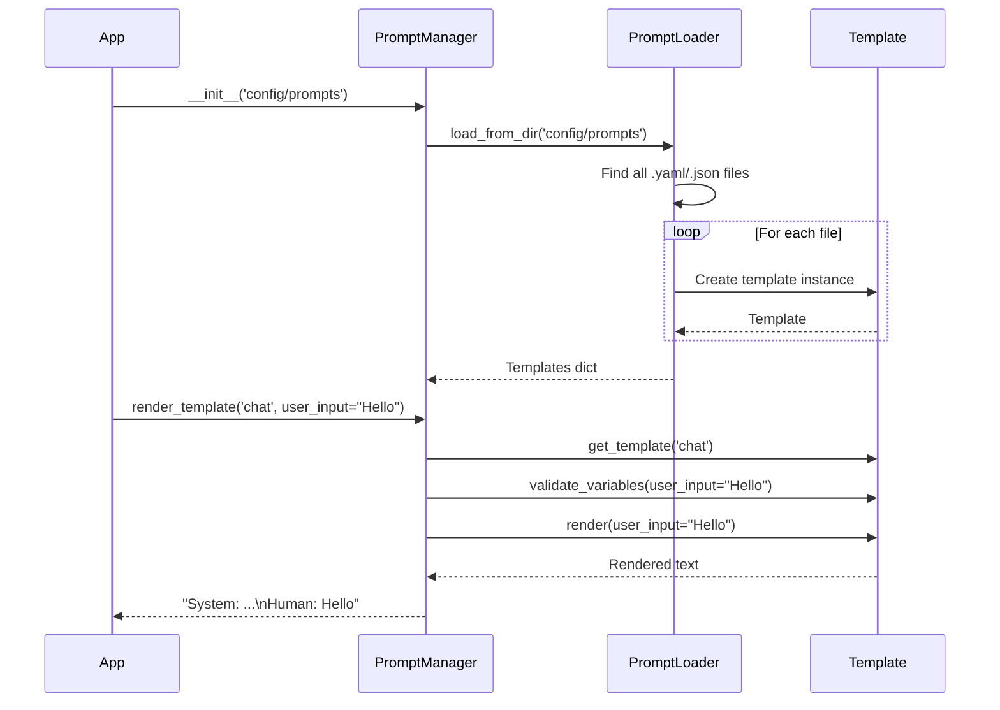
```mermaid
sequenceDiagram
    participant App
    participant PromptManager
    participant PromptLoader
    participant Template
    
    App->>PromptManager: __init__('config/prompts')
    PromptManager->>PromptLoader: load_from_dir('config/prompts')
    PromptLoader->>PromptLoader: Find all .yaml/.json files
    loop For each file
        PromptLoader->>Template: Create template instance
        Template-->>PromptLoader: Template
    end
    PromptLoader-->>PromptManager: Templates dict
    
    App->>PromptManager: render_template('chat', user_input="Hello")
    PromptManager->>Template: get_template('chat')
    PromptManager->>Template: validate_variables(user_input="Hello")
    PromptManager->>Template: render(user_input="Hello")
    Template-->>PromptManager: Rendered text
    PromptManager-->>App: "System: ...\nHuman: Hello"
```

**Example:**
```python
manager = PromptManager('config/prompts')
prompt = manager.render_template('chat_template', 
                                 user_input="What is AI?",
                                 context="Educational")
```

### 3.3 Template Type Detection

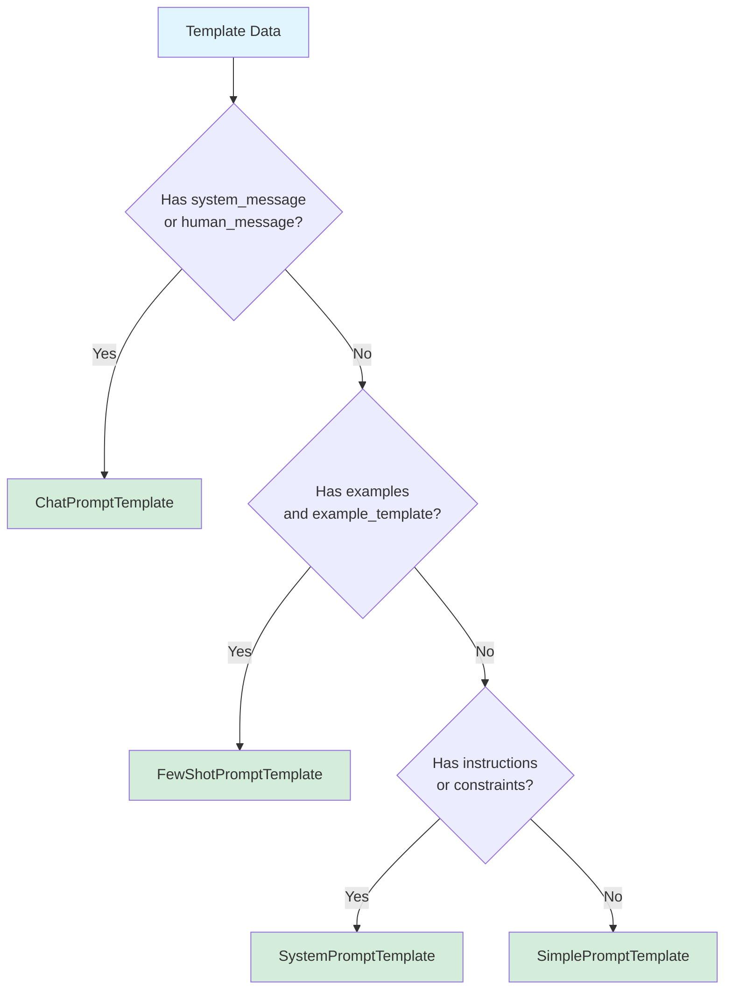
```mermaid
flowchart TD
    A[Template Data] --> B{Has system_message<br/>or human_message?}
    B -->|Yes| C[ChatPromptTemplate]
    B -->|No| D{Has examples<br/>and example_template?}
    
    D -->|Yes| E[FewShotPromptTemplate]
    D -->|No| F{Has instructions<br/>or constraints?}
    
    F -->|Yes| G[SystemPromptTemplate]
    F -->|No| H[SimplePromptTemplate]
    
    style A fill:#e1f5ff
    style C fill:#d4edda
    style E fill:#d4edda
    style G fill:#d4edda
    style H fill:#d4edda
```

---

## 4. Output Parsing

### 4.1 Parser Selection and Execution

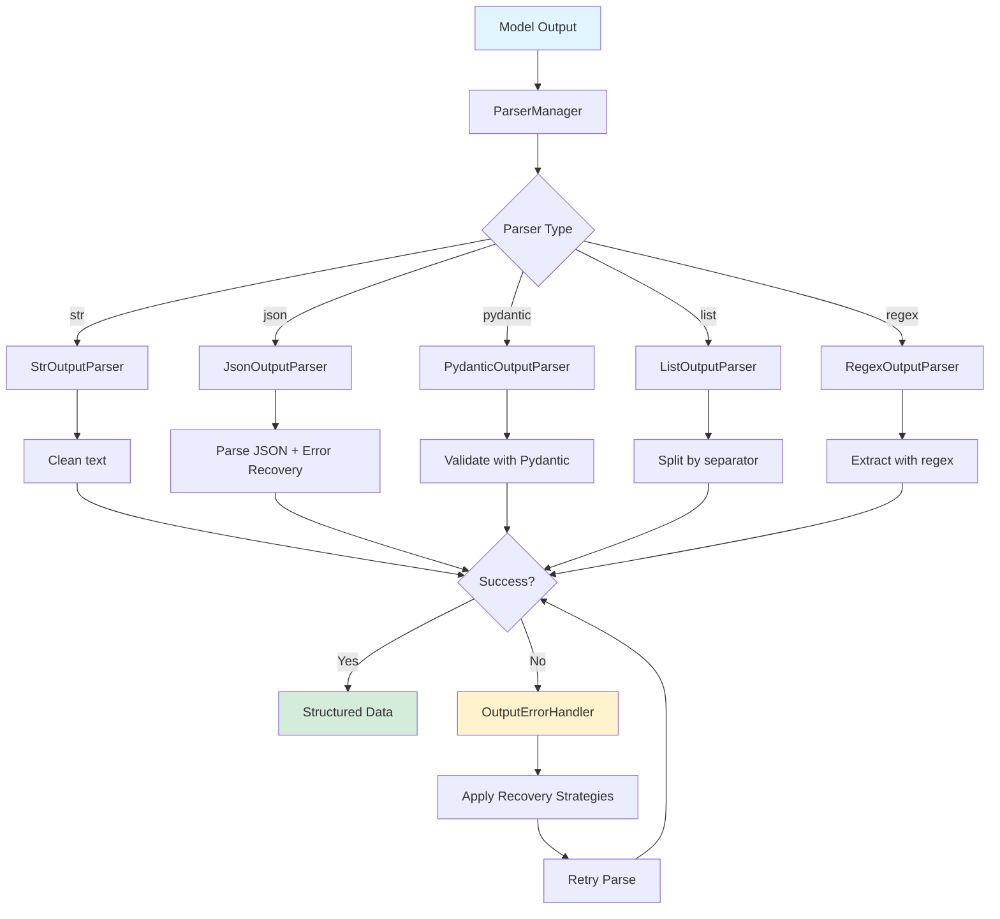
```mermaid
graph TB
    A[Model Output] --> B[ParserManager]
    B --> C{Parser Type}
    
    C -->|str| D[StrOutputParser]
    C -->|json| E[JsonOutputParser]
    C -->|pydantic| F[PydanticOutputParser]
    C -->|list| G[ListOutputParser]
    C -->|regex| H[RegexOutputParser]
    
    D --> I[Clean text]
    E --> J[Parse JSON + Error Recovery]
    F --> K[Validate with Pydantic]
    G --> L[Split by separator]
    H --> M[Extract with regex]
    
    I --> N{Success?}
    J --> N
    K --> N
    L --> N
    M --> N
    
    N -->|Yes| O[Structured Data]
    N -->|No| P[OutputErrorHandler]
    P --> Q[Apply Recovery Strategies]
    Q --> R[Retry Parse]
    R --> N
    
    style A fill:#e1f5ff
    style O fill:#d4edda
    style P fill:#fff3cd
```

### 4.2 JSON Parser with Error Recovery

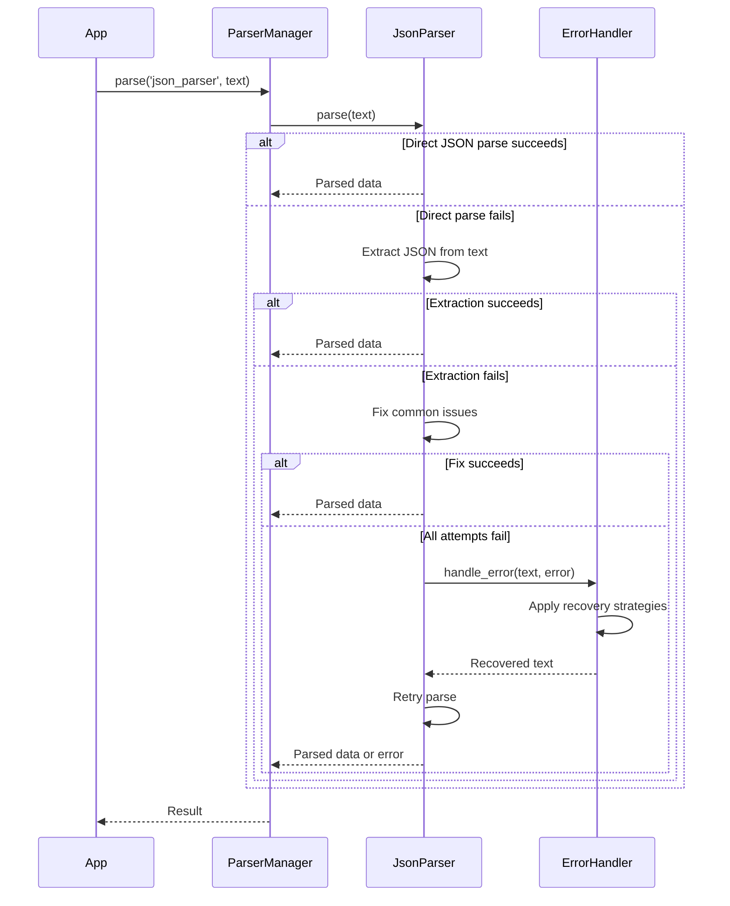
```mermaid
sequenceDiagram
    participant App
    participant ParserManager
    participant JsonParser
    participant ErrorHandler
    
    App->>ParserManager: parse('json_parser', text)
    ParserManager->>JsonParser: parse(text)
    
    alt Direct JSON parse succeeds
        JsonParser-->>ParserManager: Parsed data
    else Direct parse fails
        JsonParser->>JsonParser: Extract JSON from text
        alt Extraction succeeds
            JsonParser-->>ParserManager: Parsed data
        else Extraction fails
            JsonParser->>JsonParser: Fix common issues
            alt Fix succeeds
                JsonParser-->>ParserManager: Parsed data
            else All attempts fail
                JsonParser->>ErrorHandler: handle_error(text, error)
                ErrorHandler->>ErrorHandler: Apply recovery strategies
                ErrorHandler-->>JsonParser: Recovered text
                JsonParser->>JsonParser: Retry parse
                JsonParser-->>ParserManager: Parsed data or error
            end
        end
    end
    
    ParserManager-->>App: Result
```

**Example:**
```python
manager = ParserManager()
manager.create_json_parser('json_parser')

# Handles malformed JSON automatically
result = manager.parse('json_parser', '{"name": "John", "age": 30,}')
```

### 4.3 Parser Fallback Chain

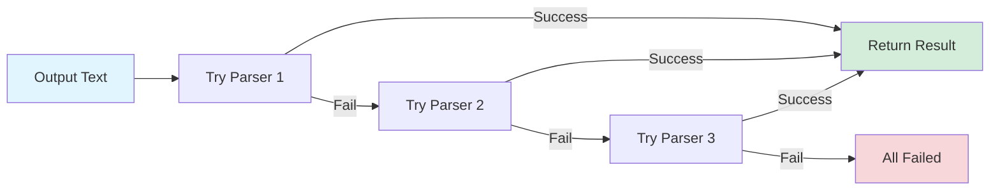
```mermaid
flowchart LR
    A[Output Text] --> B[Try Parser 1]
    B -->|Success| C[Return Result]
    B -->|Fail| D[Try Parser 2]
    D -->|Success| C
    D -->|Fail| E[Try Parser 3]
    E -->|Success| C
    E -->|Fail| F[All Failed]
    
    style A fill:#e1f5ff
    style C fill:#d4edda
    style F fill:#f8d7da
```

---

## 5. Streaming Processing

### 5.1 Streaming Session Lifecycle

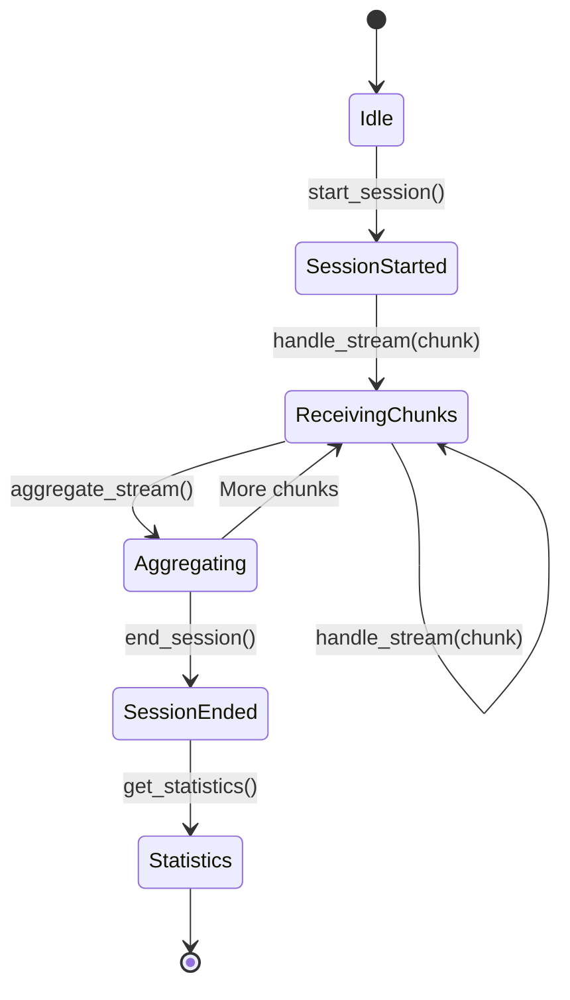
```mermaid
stateDiagram-v2
    [*] --> Idle
    Idle --> SessionStarted: start_session()
    
    SessionStarted --> ReceivingChunks: handle_stream(chunk)
    ReceivingChunks --> ReceivingChunks: handle_stream(chunk)
    ReceivingChunks --> Aggregating: aggregate_stream()
    
    Aggregating --> ReceivingChunks: More chunks
    Aggregating --> SessionEnded: end_session()
    
    SessionEnded --> Statistics: get_statistics()
    Statistics --> [*]
```

### 5.2 StreamCallback Integration

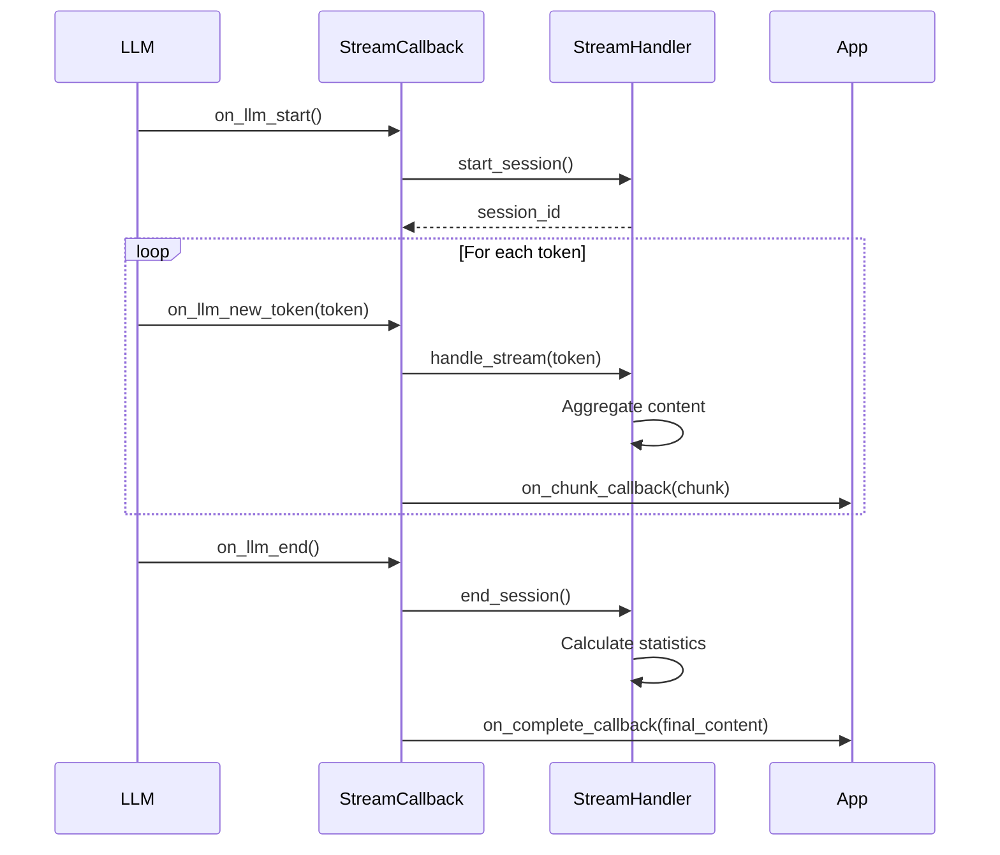
```mermaid
sequenceDiagram
    participant LLM
    participant StreamCallback
    participant StreamHandler
    participant App
    
    LLM->>StreamCallback: on_llm_start()
    StreamCallback->>StreamHandler: start_session()
    StreamHandler-->>StreamCallback: session_id
    
    loop For each token
        LLM->>StreamCallback: on_llm_new_token(token)
        StreamCallback->>StreamHandler: handle_stream(token)
        StreamHandler->>StreamHandler: Aggregate content
        StreamCallback->>App: on_chunk_callback(chunk)
    end
    
    LLM->>StreamCallback: on_llm_end()
    StreamCallback->>StreamHandler: end_session()
    StreamHandler->>StreamHandler: Calculate statistics
    StreamCallback->>App: on_complete_callback(final_content)
```

**Example:**
```python
handler = StreamHandler()
callback = StreamCallback(
    stream_handler=handler,
    on_chunk_callback=lambda chunk: print(chunk.content, end=''),
    on_complete_callback=lambda text: print(f"\n\nTotal: {len(text)} chars")
)

# Use with LangChain
model.invoke(prompt, config={"callbacks": [callback]})
```

### 5.3 Buffered Streaming

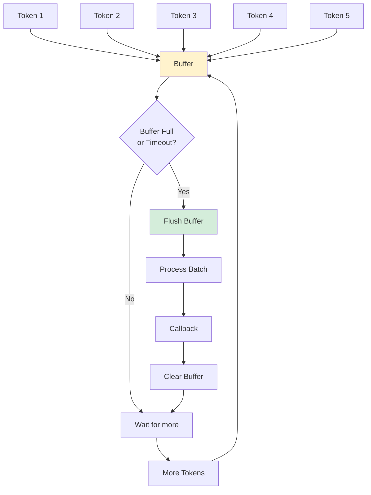
```mermaid
flowchart TD
    A[Token 1] --> B[Buffer]
    C[Token 2] --> B
    D[Token 3] --> B
    E[Token 4] --> B
    F[Token 5] --> B
    
    B --> G{Buffer Full<br/>or Timeout?}
    G -->|Yes| H[Flush Buffer]
    G -->|No| I[Wait for more]
    
    H --> J[Process Batch]
    J --> K[Callback]
    K --> L[Clear Buffer]
    L --> I
    
    I --> M[More Tokens]
    M --> B
    
    style B fill:#fff3cd
    style H fill:#d4edda
```

---

## 6. Error Handling

### 6.1 Error Handling Pipeline

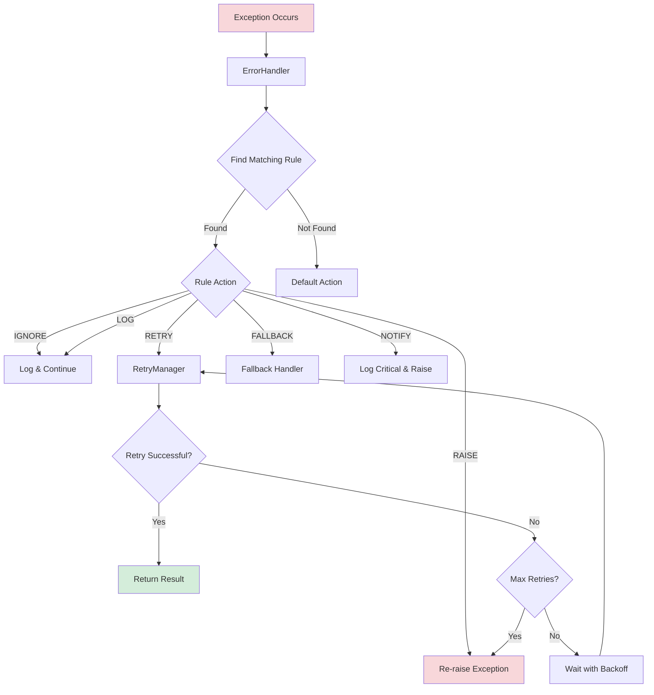
```mermaid
graph TB
    A[Exception Occurs] --> B[ErrorHandler]
    B --> C{Find Matching Rule}
    
    C -->|Found| D{Rule Action}
    C -->|Not Found| E[Default Action]
    
    D -->|IGNORE| F[Log & Continue]
    D -->|LOG| F
    D -->|RETRY| G[RetryManager]
    D -->|FALLBACK| H[Fallback Handler]
    D -->|RAISE| I[Re-raise Exception]
    D -->|NOTIFY| J[Log Critical & Raise]
    
    G --> K{Retry Successful?}
    K -->|Yes| L[Return Result]
    K -->|No| M{Max Retries?}
    M -->|Yes| I
    M -->|No| N[Wait with Backoff]
    N --> G
    
    style A fill:#f8d7da
    style L fill:#d4edda
    style I fill:#f8d7da
```


### 6.2 Retry Manager with Circuit Breaker

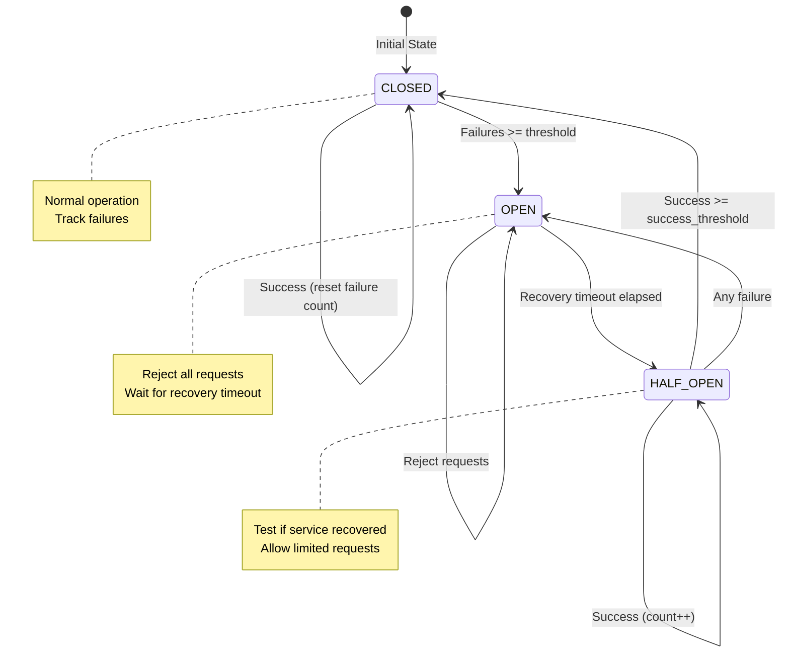
```mermaid
stateDiagram-v2
    [*] --> CLOSED: Initial State
    
    CLOSED --> CLOSED: Success (reset failure count)
    CLOSED --> OPEN: Failures >= threshold
    
    OPEN --> OPEN: Reject requests
    OPEN --> HALF_OPEN: Recovery timeout elapsed
    
    HALF_OPEN --> CLOSED: Success >= success_threshold
    HALF_OPEN --> OPEN: Any failure
    HALF_OPEN --> HALF_OPEN: Success (count++)
    
    note right of CLOSED
        Normal operation
        Track failures
    end note
    
    note right of OPEN
        Reject all requests
        Wait for recovery timeout
    end note
    
    note right of HALF_OPEN
        Test if service recovered
        Allow limited requests
    end note
```

### 6.3 Retry Strategies Comparison

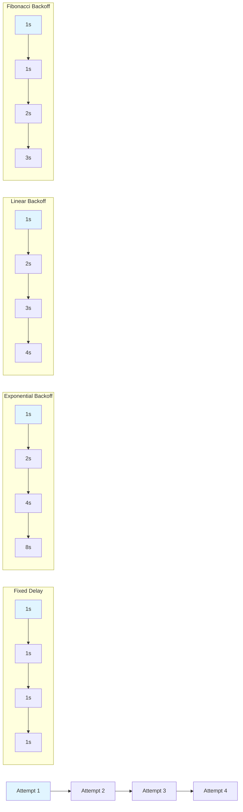
```mermaid
graph LR
    A[Attempt 1] --> B[Attempt 2]
    B --> C[Attempt 3]
    C --> D[Attempt 4]
    
    subgraph Fixed Delay
    A1[1s] --> B1[1s]
    B1 --> C1[1s]
    C1 --> D1[1s]
    end
    
    subgraph Exponential Backoff
    A2[1s] --> B2[2s]
    B2 --> C2[4s]
    C2 --> D2[8s]
    end
    
    subgraph Linear Backoff
    A3[1s] --> B3[2s]
    B3 --> C3[3s]
    C3 --> D3[4s]
    end
    
    subgraph Fibonacci Backoff
    A4[1s] --> B4[1s]
    B4 --> C4[2s]
    C4 --> D4[3s]
    end
    
    style A fill:#e1f5ff
    style A1 fill:#e1f5ff
    style A2 fill:#e1f5ff
    style A3 fill:#e1f5ff
    style A4 fill:#e1f5ff
```

**Example:**
```python
retry_manager = RetryManager(
    config=RetryConfig(
        max_attempts=3,
        strategy=RetryStrategy.EXPONENTIAL_BACKOFF,
        base_delay=1.0
    ),
    circuit_config=CircuitBreakerConfig(
        failure_threshold=5,
        recovery_timeout=60.0
    )
)

result = retry_manager.retry(risky_function)
```

### 6.4 Exception Hierarchy

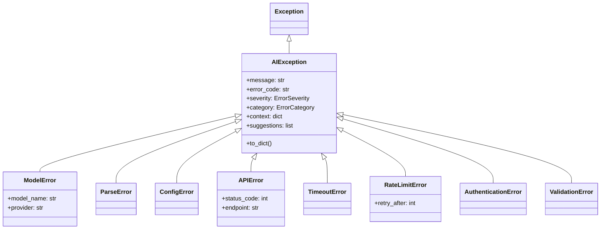
```mermaid
classDiagram
    Exception <|-- AIException
    AIException <|-- ModelError
    AIException <|-- ParseError
    AIException <|-- ConfigError
    AIException <|-- APIError
    AIException <|-- TimeoutError
    AIException <|-- RateLimitError
    AIException <|-- AuthenticationError
    AIException <|-- ValidationError
    
    class AIException {
        +message: str
        +error_code: str
        +severity: ErrorSeverity
        +category: ErrorCategory
        +context: dict
        +suggestions: list
        +to_dict()
    }
    
    class ModelError {
        +model_name: str
        +provider: str
    }
    
    class APIError {
        +status_code: int
        +endpoint: str
    }
    
    class RateLimitError {
        +retry_after: int
    }
```

---

## 7. Token Management

### 7.1 Token Counting and Cost Estimation

```mermaid
flowchart TD
    A[Input Text] --> B[TokenCounter]
    B --> C{Model Type}
    
    C -->|GPT-4/3.5| D[Tiktoken cl100k_base]
    C -->|Other| E[Tiktoken fallback]
    
    D --> F[Token Count]
    E --> F
    
    F --> G[Get Model Pricing]
    G --> H[Calculate Cost]
    H --> I[prompt_tokens × price_per_1k / 1000]
    H --> J[completion_tokens × price_per_1k / 1000]
    
    I --> K[Total Cost]
    J --> K
    
    K --> L[CostEstimate]
    
    style A fill:#e1f5ff
    style L fill:#d4edda
```

### 7.2 Token Optimization Pipeline

```mermaid
sequenceDiagram
    participant App
    participant TokenOptimizer
    participant TokenCounter
    
    App->>TokenOptimizer: optimize_text(text, max_tokens)
    TokenOptimizer->>TokenCounter: count_tokens(text)
    TokenCounter-->>TokenOptimizer: original_tokens
    
    alt original_tokens <= max_tokens
        TokenOptimizer-->>App: Original text (no optimization)
    else Needs optimization
        TokenOptimizer->>TokenOptimizer: compress_text()
        TokenOptimizer->>TokenOptimizer: Remove redundancy
        TokenOptimizer->>TokenCounter: count_tokens(compressed)
        TokenCounter-->>TokenOptimizer: compressed_tokens
        
        alt compressed_tokens <= max_tokens
            TokenOptimizer-->>App: Compressed text
        else Still too long
            TokenOptimizer->>TokenOptimizer: truncate_text(strategy)
            TokenOptimizer->>TokenCounter: count_tokens(truncated)
            TokenCounter-->>TokenOptimizer: final_tokens
            TokenOptimizer-->>App: Truncated text
        end
    end
```

### 7.3 Optimization Strategies

```mermaid
graph TB
    A[Original Text: 1000 tokens] --> B{Strategy}
    
    B -->|COMPRESS| C[Remove redundancy]
    C --> C1[Remove extra spaces]
    C1 --> C2[Remove filler words]
    C2 --> C3[Fix punctuation]
    C3 --> D[Compressed: 850 tokens]
    
    B -->|TRUNCATE_END| E[Keep beginning]
    E --> F[Truncated: 500 tokens]
    
    B -->|TRUNCATE_START| G[Keep end]
    G --> H[Truncated: 500 tokens]
    
    B -->|TRUNCATE_MIDDLE| I[Keep start + end]
    I --> J[Truncated: 500 tokens]
    
    B -->|SUMMARIZE| K[Extract key sentences]
    K --> L[Summarized: 300 tokens]
    
    style A fill:#e1f5ff
    style D fill:#d4edda
    style F fill:#d4edda
    style H fill:#d4edda
    style J fill:#d4edda
    style L fill:#d4edda
```

**Example:**
```python
counter = TokenCounter(model='gpt-4')
optimizer = TokenOptimizer(counter)

# Compress text
result = optimizer.compress_text(long_text)
print(f"Saved {result.tokens_saved} tokens ({result.savings_percentage:.1f}%)")

# Optimize for cost
result = optimizer.optimize_for_cost(text, max_cost=0.01, model='gpt-4')
```

### 7.4 Message Optimization

```mermaid
flowchart TD
    A[Message List] --> B{Total tokens > max?}
    B -->|No| C[Return original]
    B -->|Yes| D[Separate system messages]
    
    D --> E[Keep system messages]
    D --> F[Keep last N messages]
    D --> G[Remaining messages]
    
    G --> H{Fit in budget?}
    H -->|Yes| I[Add to result]
    H -->|No| J[Compress message]
    
    J --> K{Compressed fits?}
    K -->|Yes| I
    K -->|No| L[Skip message]
    
    I --> M[Combine all parts]
    F --> M
    E --> M
    
    M --> N[Optimized messages]
    
    style A fill:#e1f5ff
    style N fill:#d4edda
```

---

## 8. Utilities

### 8.1 Logger Setup Workflow

```mermaid
flowchart TD
    A[setup_logger] --> B{Console logging?}
    B -->|Yes| C[Create StreamHandler]
    B -->|No| D[Skip console]
    
    C --> E{Log file specified?}
    D --> E
    
    E -->|Yes| F{Rotation type?}
    E -->|No| G[Logger ready]
    
    F -->|size| H[RotatingFileHandler]
    F -->|time| I[TimedRotatingFileHandler]
    F -->|none| J[FileHandler]
    
    H --> K[Set formatter]
    I --> K
    J --> K
    C --> K
    
    K --> G
    
    style A fill:#e1f5ff
    style G fill:#d4edda
```

**Example:**
```python
logger = setup_logger(
    name='my_app',
    level='INFO',
    log_file='logs/app.log',
    rotation='size',
    max_bytes=10*1024*1024,  # 10MB
    backup_count=5
)

logger.info("Application started")
```

### 8.2 File Operations Flow

```mermaid
graph LR
    A[File Operation] --> B{Operation Type}
    
    B -->|Read| C[read_file/read_json]
    B -->|Write| D[write_file/write_json]
    B -->|Copy| E[copy_file/copy_dir]
    B -->|Move| F[move_file]
    B -->|Delete| G[delete_file/delete_dir]
    B -->|List| H[list_files/list_dirs]
    
    C --> I[Return content]
    D --> J[Ensure dir exists]
    J --> K[Write content]
    E --> L[Ensure dest dir]
    L --> M[Copy operation]
    F --> N[Ensure dest dir]
    N --> O[Move operation]
    G --> P[Delete operation]
    H --> Q[Return list]
    
    style A fill:#e1f5ff
    style I fill:#d4edda
    style K fill:#d4edda
    style M fill:#d4edda
    style O fill:#d4edda
    style P fill:#d4edda
    style Q fill:#d4edda
```

### 8.3 Dictionary Operations

```mermaid
flowchart TD
    A[Dictionary] --> B{Operation}
    
    B -->|merge_dicts| C[Deep merge multiple dicts]
    B -->|flatten_dict| D[Convert nested to flat]
    B -->|unflatten_dict| E[Convert flat to nested]
    B -->|safe_get| F[Get nested value safely]
    B -->|safe_set| G[Set nested value safely]
    B -->|filter_dict| H[Filter by keys/predicate]
    
    C --> I[Merged dict]
    D --> J[Flat dict with dot keys]
    E --> K[Nested dict]
    F --> L[Value or default]
    G --> M[Updated dict]
    H --> N[Filtered dict]
    
    style A fill:#e1f5ff
    style I fill:#d4edda
    style J fill:#d4edda
    style K fill:#d4edda
    style L fill:#d4edda
    style M fill:#d4edda
    style N fill:#d4edda
```

**Example:**
```python
# Flatten nested dict
nested = {'a': {'b': {'c': 1}}}
flat = flatten_dict(nested)  # {'a.b.c': 1}

# Unflatten
nested_again = unflatten_dict(flat)  # {'a': {'b': {'c': 1}}}

# Safe operations
value = safe_get(nested, 'a.b.c', default=0)
safe_set(nested, 'a.b.d', 2)
```

---

## Complete Application Workflow

### End-to-End AI Application Flow

```mermaid
sequenceDiagram
    participant App
    participant Config
    participant Model
    participant Prompt
    participant Stream
    participant Parser
    participant Error
    participant Token
    
    App->>Config: Load configuration
    Config-->>App: Config ready
    
    App->>Model: Create model
    Model-->>App: Model instance
    
    App->>Prompt: Render prompt template
    Prompt-->>App: Rendered prompt
    
    App->>Token: Count tokens
    Token-->>App: Token count & cost
    
    alt Tokens too high
        App->>Token: Optimize prompt
        Token-->>App: Optimized prompt
    end
    
    App->>Model: Invoke with streaming
    
    loop Streaming
        Model->>Stream: Token chunk
        Stream->>App: Process chunk
    end
    
    Model-->>App: Complete response
    
    App->>Parser: Parse response
    
    alt Parse success
        Parser-->>App: Structured data
    else Parse error
        Parser->>Error: Handle error
        Error->>Error: Apply recovery
        Error->>Parser: Retry
        Parser-->>App: Structured data or error
    end
    
    App->>Token: Calculate final cost
    Token-->>App: Cost estimate
```

### Typical Usage Pattern

```mermaid
flowchart TD
    A[Start] --> B[Load Environment Variables]
    B --> C[Load Configuration]
    C --> D[Validate Configuration]
    D --> E[Create Model]
    
    E --> F[Load Prompt Template]
    F --> G[Render Prompt with Variables]
    G --> H[Count Tokens]
    
    H --> I{Tokens OK?}
    I -->|No| J[Optimize Prompt]
    J --> H
    I -->|Yes| K[Invoke Model]
    
    K --> L{Streaming?}
    L -->|Yes| M[Process Stream]
    L -->|No| N[Get Response]
    
    M --> O[Aggregate Chunks]
    O --> P[Parse Output]
    N --> P
    
    P --> Q{Parse Success?}
    Q -->|No| R[Error Recovery]
    R --> P
    Q -->|Yes| S[Return Result]
    
    S --> T[Calculate Cost]
    T --> U[Log Statistics]
    U --> V[End]
    
    style A fill:#e1f5ff
    style V fill:#d4edda
    style R fill:#fff3cd
```

---

## Integration Examples

### Example 1: Complete Configuration Setup

```python
from ai_toolkit.config import EnvLoader, ConfigManager, ConfigValidator
from ai_toolkit.config.config_validator import RequiredRule, RangeRule

# Step 1: Load environment
env = EnvLoader('.env')

# Step 2: Load configuration
config = ConfigManager('config/config.yaml')

# Step 3: Validate
validator = ConfigValidator()
validator.add_rule('api_key', RequiredRule())
validator.add_rule('temperature', RangeRule(0.0, 2.0))

if validator.validate(config.to_dict()):
    print("✓ Configuration valid")
else:
    print("✗ Errors:", validator.get_errors())
```

### Example 2: Model with Error Handling

```python
from ai_toolkit.models import ModelManager
from ai_toolkit.errors import ErrorHandler, RetryManager

# Setup error handling
error_handler = ErrorHandler()
retry_manager = RetryManager()

# Create model
model_manager = ModelManager('config/models.yaml')
model = model_manager.create_model('deepseek')

# Invoke with retry
def invoke_model():
    return model.invoke("What is AI?")

try:
    result = retry_manager.retry(invoke_model)
    print(result)
except Exception as e:
    error_handler.handle_error(e)
```

### Example 3: Streaming with Token Optimization

```python
from ai_toolkit.models import ModelManager
from ai_toolkit.streaming import StreamHandler, StreamCallback
from ai_toolkit.tokens import TokenCounter, TokenOptimizer

# Setup
model_manager = ModelManager()
model = model_manager.create_model('deepseek')

counter = TokenCounter()
optimizer = TokenOptimizer(counter)

# Optimize prompt
prompt = "Very long prompt text..."
optimized = optimizer.compress_text(prompt)

# Stream response
handler = StreamHandler()
callback = StreamCallback(
    stream_handler=handler,
    on_chunk_callback=lambda c: print(c.content, end='')
)

model.invoke(optimized.optimized_text, config={"callbacks": [callback]})

# Get statistics
stats = handler.get_statistics()
print(f"\nTokens: {stats['total_characters']}")
```

### Example 4: Complete Pipeline

```python
from ai_toolkit.config import ConfigManager
from ai_toolkit.models import ModelManager
from ai_toolkit.prompts import PromptManager
from ai_toolkit.parsers import ParserManager
from ai_toolkit.tokens import TokenCounter

# Initialize all components
config = ConfigManager('config/config.yaml')
models = ModelManager(config)
prompts = PromptManager('config/prompts')
parsers = ParserManager()
counter = TokenCounter()

# Create parser
parsers.create_json_parser('response_parser')

# Render prompt
prompt = prompts.render_template('analysis', topic="AI")

# Count tokens
tokens = counter.count_tokens(prompt)
print(f"Prompt tokens: {tokens}")

# Get model and invoke
model = models.get_model('deepseek')
response = model.invoke(prompt)

# Parse response
result = parsers.parse('response_parser', response.content)
print(f"Parsed result: {result}")
```

---

## Summary

This document provides visual workflows for all major components:

1. **Configuration Management**: Environment loading → Config loading → Validation
2. **Model Management**: Config → Provider → Model creation and caching
3. **Prompt Management**: Template loading → Rendering → Variable substitution
4. **Output Parsing**: Parser selection → Parsing → Error recovery
5. **Streaming**: Session management → Chunk processing → Aggregation
6. **Error Handling**: Error detection → Rule matching → Retry/Recovery
7. **Token Management**: Token counting → Cost estimation → Optimization
8. **Utilities**: Logging, file operations, and helper functions

Each workflow is illustrated with Mermaid diagrams showing the data flow, state transitions, and component interactions, along with practical examples for common use cases.
